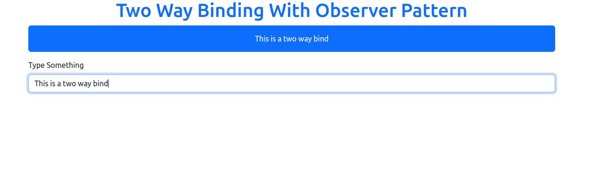

# Two Way Data Binding Using observer Pattern In Javascript

`Two way data Binding` is a feature that we can see in many modern frontend framworks. This is a simple impelmentation in `Javascript`.

## Observer Design Pattern

The Observer Design Pattern is a behavioral design pattern where an object, known as the subject, maintains a list of its dependents, known as observers, that are notified of any changes in the subject's state. This pattern is often used to implement distributed event handling systems.

### Components

1. **Subject**: The object that holds the state and manages the list of observers. It provides methods to attach, detach, and notify observers.

2. **Observer**: The interface or abstract class defining the method that the subject calls to notify changes. Concrete observers implement this interface.

3. **ConcreteSubject**: The concrete implementation of the subject. It maintains the state and sends notifications to its observers when the state changes.

4. **ConcreteObserver** : The concrete implementation of the observer. It registers with a subject to receive notifications and implements the update method to react to changes

### Implementation In Javascript

```js
// This is the Subject
class Broadecaster {
  constructor() {
    this.audiences = [];
  }

  subscribe(audience) {
    this.audiences.push(audience);
  }

  unsubscribe(audience) {
    const index = this.audiences.indexOf(audience);
    this.audiences.splice(index, 1);
  }

  //Notify subscriber by changing content
  setContent(content) {
    this.audiences.forEach((audience) => {
      audience.innerText = content;
    });
  }
}

// Our observer here is a dom element (paragraph)

const p = document.getElementById('paragraph');

const broadcaster = new Broadercaster();
broadcaster.subsbscribe(p);

document.querySelector('input').addEventListener('keyup', function () {
  broadcaster.setContent(this.value);
});
```

## Screenshot

